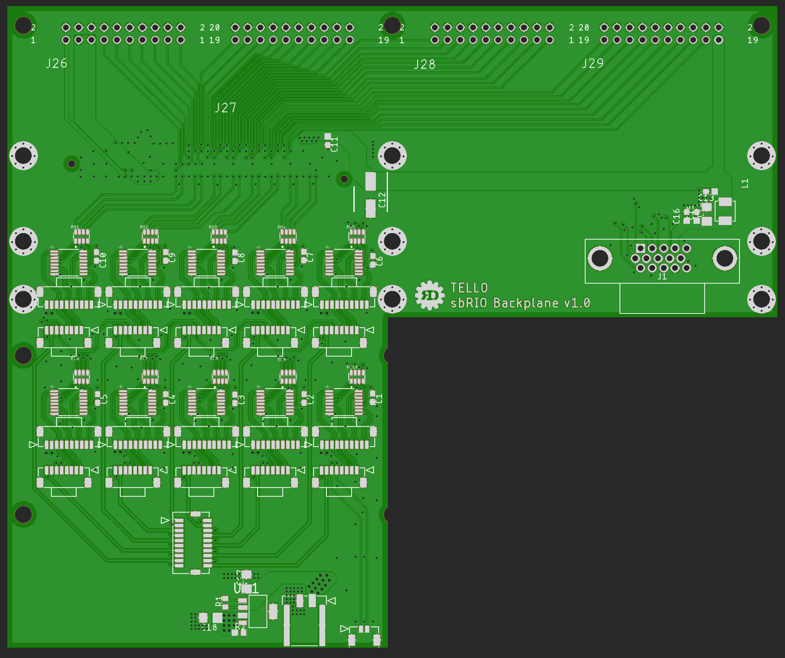
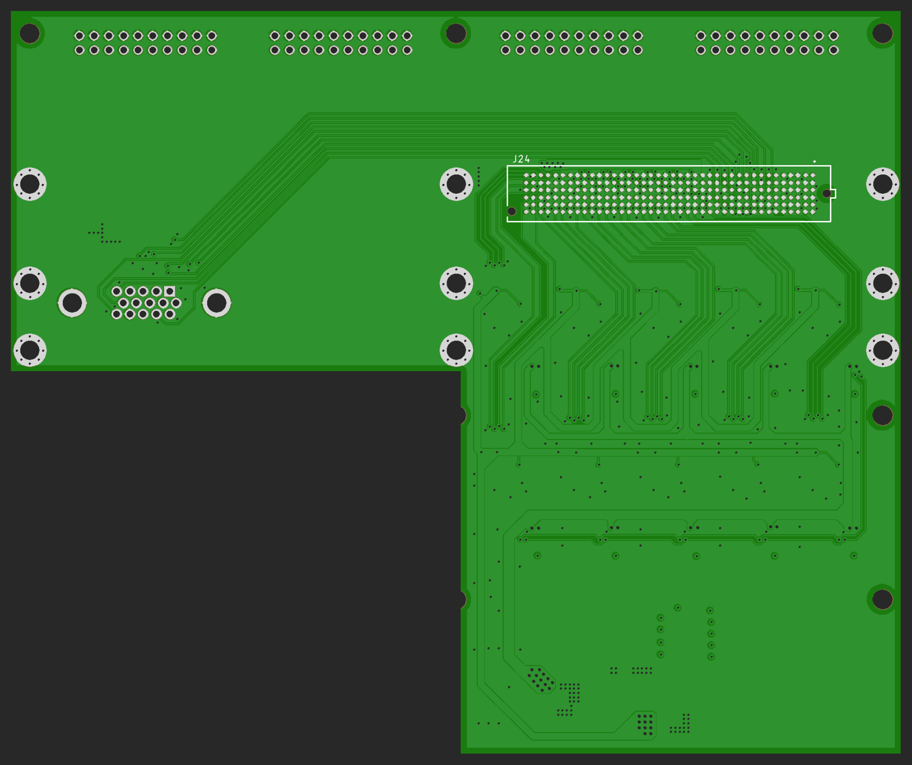

# Tello_sbRIO_Backplane
Hardware Design Files for Tello sbRIO Backplane. For Connecting 10 BiSS-C encoders and 10 AMC drivers to sbRIO.
 
 
Note: This PCB was not used. I designed this before joining RoboDesign Lab. After joining, I changed the Tello electronics to use a linux computer and MIT mini-cheetah style drivers instead of the sbRIO and AMC drivers.
 
 

  
   &nbsp; 
  

